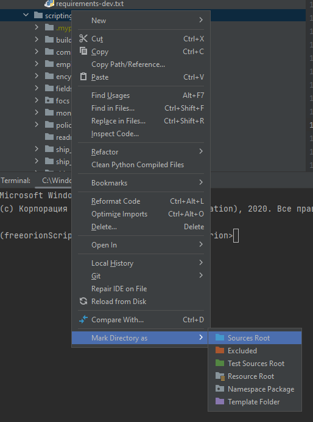
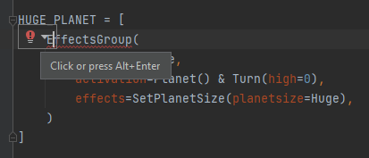
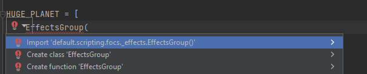
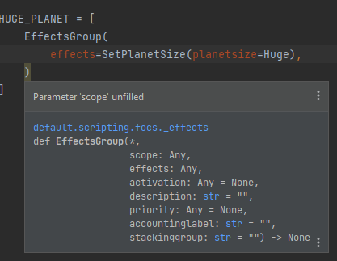
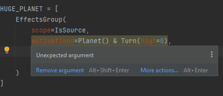

## default/scripting directory

Contains directories needed for game content.

Each sub-directory is allowed multiple files/directories,
with the exception of *starting_unlocks/*

There are 3 types on files loaded, by extension: .py, .focs.txt and .inf.
All other file extensions are safely ignored, to disable a file simply rename
the extension.

For more info on the FreeOrion Content Script language,
see http://www.freeorion.org/index.php/Effects

## .focs.[txt|py] files

May contain any number of entries and or macros.
If you need to reference a macro in a separate file, use an #include statement.

## other .py files

May contain code that is used in .focs.py files

## focs/

A directory that contains stubs for Python


## .inf files

These files are specifically targetted and may not be broken up or renamed.
inf files will not normally be included.

## empire_colors.xml file

This file contains color options available for empires to select from.

## includes

Work as normal, however all of the script files in each section are loaded.
(e.g. all of the scripts in techs and its sub-directories are loaded as techs)

Include statements should not reference script files that contain a definition.

## Contents

**All directories must contain at least one *name*.focs.[txt|py] file, with at least
one associated definition (except for common and starting_unlocks).
Additional entries may be required from other content, such as the AI or other
definitions.**

* buildings/  -  All in-game building definitions.
* common/  -  A directory to group files commonly included, no files are
loaded from here unless included elsewhere.
* empire_statistics/  -  Calculations made on a per-empire basis.
* encyclopedia/  -  Entries for in-game pedia articles.
* fields/  -  Definitions of fields (e.g. Ion Storm)
* focs/  - technical directory with code to aid development
* monster_designs/  -  Ship designs specifically for space monsters.
* policies/  -  All government policy definitions.
* ship_designs/  -  Pre-defined ship designs, this is **required for the AI**.
* ship_hulls/  -  All ship hull definitions.
* ship_parts/  -  All ship part definitions.
* specials/  -  All specials definitions.  Each individual object
(ship/planet/etc) may have specials attached.
* species/  -  All in-game species definitions.  **The *SP_HUMAN* definition
is required.**
* techs/  -  All in-game technology definitions and categories.
* monster_fleets.inf  -  Fleet definitions for space monsters
(spawn rate/quantity/limitations).  **This file and at least one entry are
required.**
* starting_unlocks/  -  Contains lists of items that are unlocked for each
player at the start of the game.
* starting_unlocks/items.inf  -  Items each player starts the game with:
completed techs and available buildings, ship hulls, and ship parts.  **This
file and at least one entry are required.**
* starting_unlocks/buildings.inf  -  Buildings each player starts with
pre-built.  **This file and at least one entry are required.**
* starting_unlocks/fleets.inf  -  Fleets each player starts with.  **This file
and at least one entry are required.**
* empire_colors.xml  -  Color options available for empires to select from.
**This file containing at least one GG::Clr node is required.**
* custom_sitreps.txt  -  Edit this to generate sitreps as useful reminders. The
file itself has more in-depth information.

## filename guidelines

* .focs.[txt|py] and .inf extensions are lower case

The following are not strictly required, but are standard guidelines:

* Replace spaces with underscore
* Single entry files are in all caps
    * SAMPLE_ENTRY.focs.txt
* Multiple entry files are in camel case, remove any spaces
    * SampleEntries.focs.txt
* Macro definitions are lower case with a .macros|.py extension
    * sample_entry.macros
* Disabled files have the extension .disabled
    * SAMPLE_ENTRY.disabled

## Python FOCS
Disclimer: Transition from focs.txt for focs.py is in progress, things might change faster than this readme. Please report a bug orsubmit a PR if this document is outdated or not clear.

### Rational

- Python parser is 10 times faster than our, and we don't need to compile it.
- We can use Python directly for templating and macroses.
- We could leverage Python tools for code competition, syntax check and formatting.

### FOCS development with Python

This is a Python code, so you need to know a basic Python syntax. Very basic, if you familiar with other languages or FOCS, it will be enough.

It's recommended to have a Python IDE for this.
<details>
<summary>Free IDE</summary>

* [PyCharm Community Edition](https://www.jetbrains.com/pycharm/download/?section=windows) scroll down for free version
* [Visual Studio Code](https://code.visualstudio.com/)

</details>


#### One time setup
- Install [Python 3.9+](https://www.python.org/downloads/)
- Open a project in the repository root
- [optional] install [pre-commit](https://pre-commit.com/) hooks
  - `pip install pre-commit`
  - `pre-commit install`
- [optional] install linting tools for manual code scan
  - `pip isntall -r default/python/requirements-dev.txt`
- Configure your IDE to treat the `default/scripting` folder as Python source (all import are relative to this folder)
  <details>
    <summary>PyCharm example</summary>

    

  </details>


#### Editing FOCS
In the global namespace you will have a lot of FOCS tokens. You need to combine them into an expression.

For example, this function call will create an effect group expression, that will change planet size on first turn and put this object to Python list. Later you could add this object to species expression.
```python
HUGE_PLANET = [
    EffectsGroup(
        scope=IsSource,
        activation=Planet() & Turn(high=0),
        effects=SetPlanetSize(planetsize=Huge),
    )
]
```
To make IDE help you, you will need to import this object from `focs._...` modules.

You could write code first and add imports later.
<details>
  <summary>Quick-fix examples</summary>

IDE have qick-fix option



That will write import items for you.



This will allow you to have basic validation right in IDE.
</details>

<details>
  <summary>Validation examples in PyCharm</summary>

Some arguments are missing



Extra arguments are added (typo in the name)



</details>

You could use CTRL+CLICK to the function EffectsGroup and see all arguments and expected types.
```python
def EffectsGroup(
    *,
    scope: _Condition,
    effects: list[_Effect] | _Effect,
    activation: _Condition | None = None,
    description: str = "",
    priority=None,
    accountinglabel: str = "",
    stackinggroup: str = "",
):
    _EffectGroup
```

Not all things are caught by IDE, some are handled by tools we are using to lint (validate) the code.

For exmaple this code uses `Source` instead of `IsSource`
```python
HUGE_PLANET = [
    EffectsGroup(
        scope=Source,
        activation=Planet() & Turn(high=0),
        effects=SetPlanetSize(planetsize=Huge),
    )
]
```

Will produce and error, that says that `_Condition` is expected (`IsSource` is a `_Condition`) but `Source` is used.
This is quite often issue, because FOCS use name Source in two contexts, and we could not do it with Python.
```
  error: Argument of type "type[Source]" cannot be assigned to parameter "scope" of type "_Condition" in function "EffectsGroup"
  "type[type]" is incompatible with "type[_Condition]" (reportGeneralTypeIssues)
```


#### Macroses
Python is much more flexible for writing macroses, since you could write a valid Python code that will be executed to generate expressions. We don't have any recommendations yet, we will rework how ported macroses looks like after migration is finished.


#### Python vs FOCS
We try to keep naming the same as much as possible. Still a bit of limitation from Python.

We could not use the same name for different things.
- txt `Source` in condition context was renamed to `IsSource`, it's hard to create and object that will work in two different contexts.
- txt `Statistic If condition` -> `StatisticIf`, because `if` is reserved keyword in Python
- txt `min`,  `max` -> `Min`, `Max`, conflict with builtin names.

focs imported things, are not really the same as at the parsing type, it's just manually created stubs, that try to mimic runtime thins. If you see any mismatch, please report and issue.

#### Running checks manually
This check will ba automatically run on GitHub when you will create a PR. But it will take some time, and running them manually will save some time.

##### Running checks on commit
Just install pre-commit hooks and check will run on each commit. Your code will be reformatted to the standard (do not spend any time on manual formatting, let the computer do it for you) and basic check will be executed.

You could run hooks without commit on all changed files:
```shell
pre-commit run
```

If you want to commit partial result, but don't want to fix all things now, just skip hooks:
```shell
git commit -n
pre-commit uninstall  # if you commit via IDE and it does not allow to skip hooks
```
These check will still be run when you will create a PR, so it's better to fix them before publishing your code.

Run pre-commit hooks on all files:
```shell
pre-commit run --all-files
```

Also, you could just run each tools that are used in pre-commit hooks manually.
```shell
ruff .  # will remove unused imports, sort import and fix/report code warnings
black .  # reformat code
mypy .  # report typing errors
pyright  # report typing errors, similar to mypy, but have some missed and extra checks.
```

### Developing FOCS API
Every time you add/remove/change the FOCS object in C++ code, you need to update files in focs folder.

There are 2 types of files:
- `.py` these are actual Python file which are executed during the game. Often they should be empty. Game wil populate `globals()` in runtime, so it's pretty safe to import object form it. `_types.py` is a bit special, it contains type declaration, that could be used in macroses and `.pyi` files.
- `.pyi` this is a typing stub, it's never executed.
  - These files are written with a more modern Python version that py files (they are not executed, we use the latest versions of linter, which support it)
  - It should match the name of `.py`. When you do a static analysis with IDE, mypy or pyright, it will take the type information from this file.
  - When you use import in this file, it will execute `.py`,  so the value you import should be in `.py`, not to `.pyi`, that's why we have `_types.py`
